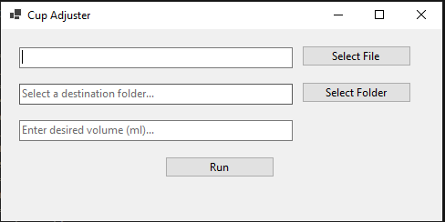
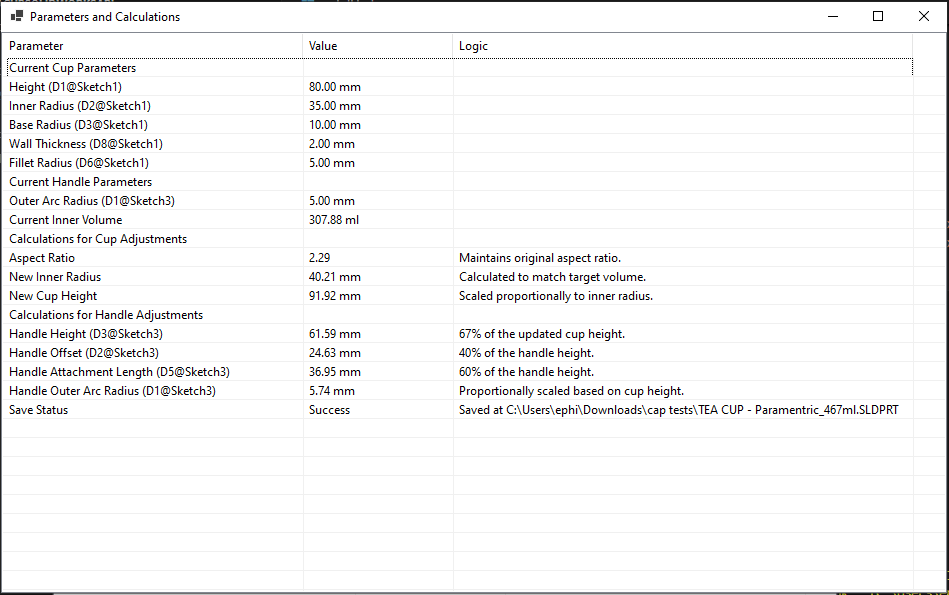
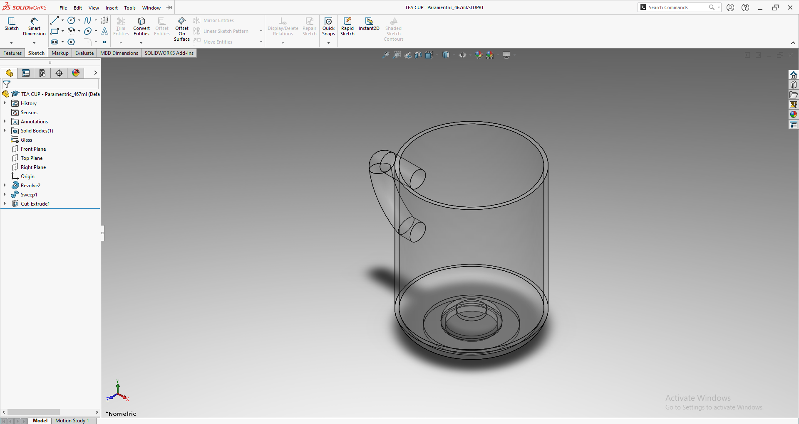

# Tea Cup SolidWorks API project

This project demonstrates a parametric model adjustment for a tea cup using the SolidWorks API and .NET. It allows users to specify a target volume (in milliliters), adjust the dimensions of a cup model accordingly, and save the modified file.

---

## Features

- **Parametric Design**: Automatically adjusts cup and handle dimensions while maintaining aspect ratios.
- **Volume Calculation**: Calculates the new dimensions based on the desired inner volume.
- **GUI Interface**: User-friendly application to select files, folders, and target volume.
- **Detailed Parameters Table**: Displays current parameters, calculations, and logic in a structured format.
- **Save Adjusted Model**: Saves the updated SolidWorks part file in the specified destination folder.

---

## Getting Started

### **Prerequisites**

1. **SolidWorks Software**
   - SolidWorks must be installed on your system with API support.

2. **.NET SDK Software**
   - Download and install the .NET 6.0 SDK (or later) from [Microsoft .NET](https://dotnet.microsoft.com/download).

3. **SolidWorks API DLLs Files**
   - Ensure you have access to the `SolidWorks.Interop.sldworks.dll` and `SolidWorks.Interop.swconst.dll` files.

---

## Installation Instructions

1. **Download the Project**

   - Visit the GitHub repository: [Tea Cup SolidWorks API](https://github.com/ephi052/TeaCupSolidWorksAPI).
   - Click on the **Code** button and select **Download ZIP**, or clone the repository:

     ```bash
     git clone https://github.com/ephi052/TeaCupSolidWorksAPI.git
     ```

2. **Run the Install Script**

   - Navigate to the project folder:

     ```bash
     cd TeaCupSolidWorksAPI
     ```

   - Run the `install.bat` script:

     ```bash
     .\install.bat
     ```

   This script:
   - Copies the required SolidWorks API DLLs into the `libs` folder.
   - Restores NuGet dependencies.
   - Builds the project.

3. **Prepare SolidWorks**

   - The project includes a sample parametric SolidWorks part file: `TEA CUP - Parametric.SLDPRT`.
   - Use this file as input for the application.

---

## Usage Instructions

1. **Launch the Application**

   Run the application from the command line:

   ```bash
   dotnet run
   ```

   The GUI interface will appear.

2. **Select Input File**

   - Click **Select File** to choose a SolidWorks part file (`.SLDPRT`).

3. **Select Destination Folder**

   - Click **Select Folder** to specify where the adjusted file will be saved.

4. **Enter Target Volume**

   - Input the desired inner volume (in milliliters) into the text box.

5. **Run Adjustment**

   - Click **Run** to process the file.
   - The application will calculate the new parameters, adjust the model, and save the updated file in the specified folder.

6. **View Parameters Table**

   After processing, a new window will display:

   - Current cup and handle parameters.
   - Logic and calculations for the adjustments.
   - Save status and path of the modified file.

---

## Screenshots

### **Input Window**
The user interface for selecting files, folders, and target volume:



### **Parameters Table**
The output window displaying calculations and adjusted parameters:



### **SolidWorks Model**
An example of the adjusted tea cup model:



---

## Math Explanation

### **Volume Adjustment Logic**
The inner volume of the tea cup is calculated based on the geometric dimensions:

1. **Inner Cup Volume Formula**:
   The cup is modeled as a combination of a cylindrical body and curved base:
   
   - Cylindrical Volume: 
     $$V_{cylinder} = \pi \times (R_{inner}^2) \times H$$
     Where:
     - $$R_{inner}$$ : Inner radius of the cup.
     - $$H$$ : Height of the cup.

   - Curved Base Adjustment:
     The volume of the curved base is approximated based on its geometry.
     $$V_{base adjustment} = \frac{\pi \times h^2 \times (3R - h)}{6}$$

   The total volume is:
   $$V_{total} = V_{cylinder} - V_{base adjustment}$$

2. **Aspect Ratio Maintenance**:
   To ensure the cup maintains its original shape, the aspect ratio ($$H / R_{inner}$$) is preserved during resizing.

3. **New Dimensions Calculation**:
   - Given a target volume $$V_{target}$$:
     - Calculate the new inner radius $$R_{inner,new}$$ :
       $$R_{inner,new} = \sqrt{\frac{V_{target}}{\pi \times H}}$$
     - Adjust the height $$H_{new}$$ proportionally to maintain the aspect ratio:
       $$H_{new} = R_{inner,new} \times (H / R_{inner})$$

### **Handle Adjustment Logic**
The handle dimensions are adjusted based on the updated cup dimensions:

1. **Handle Height**:
   $$H_{handle} = H_{new} \times 0.67$$
   Logic: The handle height is set to 67% of the new cup height.

2. **Handle Offset**:
   $$Offset_{handle} = H_{handle} \times 0.40$$
   Logic: The offset is 40% of the handle height.

3. **Attachment Length**:
   $$L_{attach} = H_{handle} \times 0.60$$
   Logic: The attachment length is 60% of the handle height.

4. **Outer Arc Radius**:
   The outer arc radius of the handle is scaled proportionally to match the new cup height.

---

## Parameters Table and Formulas

### **Cup Parameters**

| Parameter                | Symbol        | Formula/Value                 |
|--------------------------|---------------|-------------------------------|
| Height                   | $$H$$        | Adjusted based on aspect ratio. |
| Inner Radius             | $$R_{inner}$$| $$R_{inner,new} = \sqrt{\frac{V_{target}}{\pi \times H}}$$ |
| Base Radius              | $$R_{base}$$ | Defined in the model          |
| Wall Thickness           | $$T$$        | Defined in the model          |
| Fillet Radius            | $$R_{fillet}$$| Defined in the model          |
| Inner Volume             | $$V$$        | $$V_{total} = V_{cylinder} - V_{base adjustment}$$ |

### **Handle Parameters**

| Parameter                | Symbol        | Formula/Value                 |
|--------------------------|---------------|-------------------------------|
| Handle Height            | $$H_{handle}$$| $$H_{handle} = H_{new} \times 0.67$$ |
| Handle Offset            | $$Offset$$   | $$Offset_{handle} = H_{handle} \times 0.40$$ |
| Handle Attachment Length | $$L_{attach}$$| $$L_{attach} = H_{handle} \times 0.60$$ |
| Outer Arc Radius         | $$R_{outer}$$| Adjusted proportionally       |

---

## Project Structure

```plaintext
TeaCupSolidWorksAPI/
│
├── install.bat                  # Install script for dependencies and setup
├── README.md                    # Project documentation
├── .gitignore                   # Git ignore rules
├── libs/                        # SolidWorks API DLLs
│   ├── SolidWorks.Interop.sldworks.dll
│   ├── SolidWorks.Interop.swconst.dll
├── Program.cs                   # Main application logic
├── TeaCupSolidWorksAPI.csproj   # .NET project file
├── TEA CUP - Parametric.SLDPRT  # Sample parametric SolidWorks part file
└── images/                      # Screenshots for README
    ├── input_popup.png
    ├── output_popup.png
    ├── res.png
```

---

## Development

### **Key Features in Code**

1. **Volume Adjustment Logic**:
   - Calculates the new dimensions for the cup and handle while maintaining the original aspect ratio.

2. **SolidWorks API Integration**:
   - Utilizes the SolidWorks API to programmatically read and modify part parameters.

3. **Save Modified Part**:
   - Automatically saves the adjusted file with updated parameters in the specified folder.

---

## Contributing

Contributions are welcome! To contribute:

1. Fork the repository.
2. Create a new branch for your feature or bug fix:
   ```bash
   git checkout -b feature-name
   ```
3. Commit your changes and push them:
   ```bash
   git push origin feature-name
   ```
4. Open a pull request.

---

## License

This project is licensed under the MIT License. See the [LICENSE](LICENSE) file for more details.

